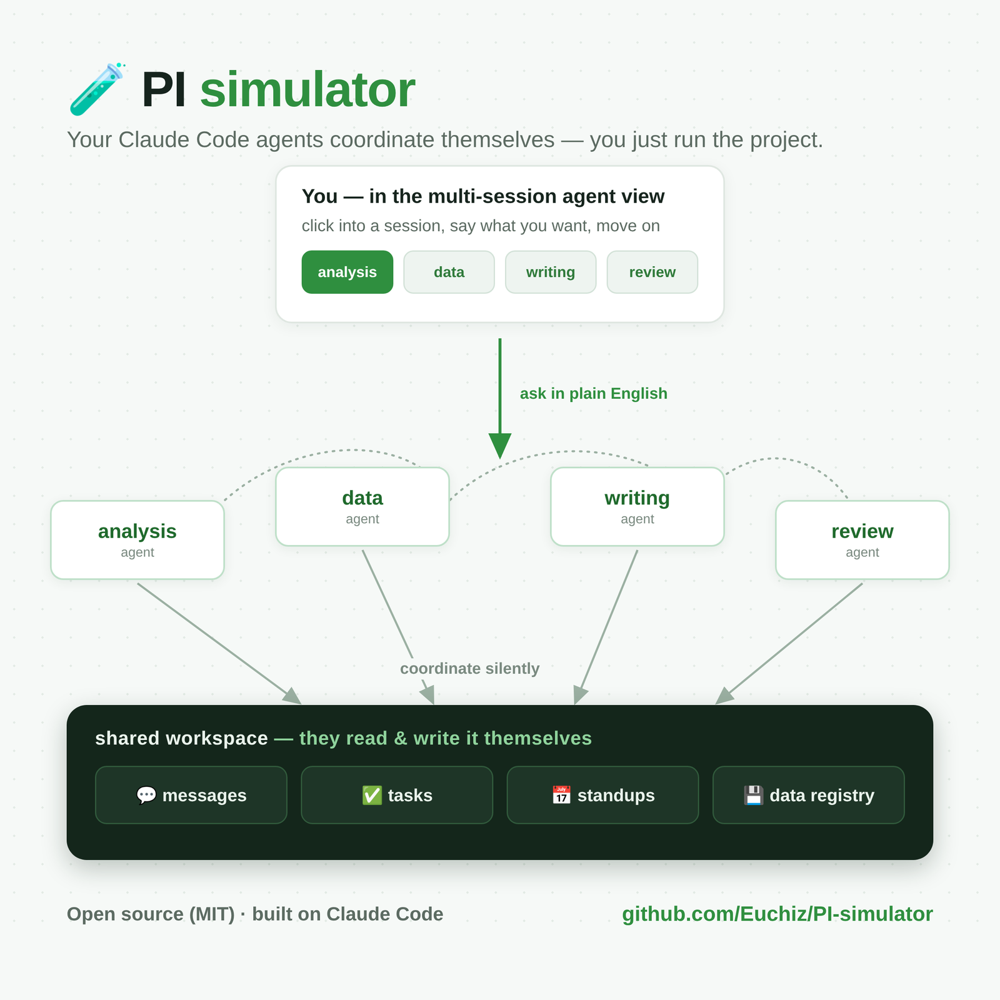

# 🧪 PI simulator

### You have several AI agents on your project. Right now, *you* are the one carrying messages between them.

> You copy a result out of one terminal and paste it into another.
> You keep track of which agent is waiting on what.
> You ask each one what it did this week so you can write it up.
> Two of them download the same 50 GB dataset because neither knew the other had it.

**PI simulator gives your agents a shared workspace so they can do all of that themselves** — message
each other, pick up work, hold a weekly standup, and keep one honest list of the data they've
produced. You go back to *running* the project instead of relaying for it.

<p align="center">
  
</p>

### How you actually use it

You stay in Claude Code's multi-session view — the list of your agents. You click into one, tell it
what you want in plain English (*"check with the others whether we already have this dataset"*,
*"draft the weekly summary from everyone's updates"*), and move on to the next.

**The agents do the coordinating between themselves, silently.** Under the hood they're running
small commands like the ones below — but *you* rarely type any of them. It's plumbing your agents
share, not a tool you operate.

```
lab who                        an agent checks who else is around
lab task                       an agent looks for work to pick up
lab send <agent> "…" "…"       an agent hands something to another
lab data check <dataset-id>    an agent checks before re-downloading
```

## 🚀 Setting it up

**Ask an agent to do it.** Clone this repo, open a Claude Code session inside it, and paste:

> Read `docs/AGENT-SETUP.md` in this repo and set up PI simulator for me. Follow it exactly:
> detect what you can, ask me only what you genuinely can't, and verify at the end.

It works out what your machine needs, asks you a few questions, sets everything up, and checks that
it actually works before telling you it's done. That's the intended route — you shouldn't have to
read any of the rest of this.

<details>
<summary>Prefer to do it by hand</summary>

```bash
git clone git@github.com:Euchiz/PI-simulator.git
cd PI-simulator && ./install.sh
lab init ~/lab
echo 'export LAB_HOME=~/lab' >> ~/.bashrc
lab register analysis /path/to/project    # once per agent
```
</details>

**You need [Claude Code](https://github.com/anthropics/claude-code).** That's where the agents
live, and it's how this tool tells them apart. Everything else it needs is already on a normal
Linux or Mac machine.

## ✨ What your agents can now do

💬 &nbsp; **Talk to each other.** &nbsp; One agent messages another and the reply comes straight back
to it, without going through you. If an agent is renamed or restarted, its messages still find it —
and if you write to one that's gone, it *tells* you instead of quietly losing the message.

📋 &nbsp; **Pick up work.** &nbsp; Anyone posts a task with a title and a description. Tag an agent to
say *"see if you can help"* — a nudge, not an assignment, and the task stays open to whoever gets
there first. Once someone claims it, nobody else grabs it by mistake, and whoever posted it hears
when it's done or abandoned.

📅 &nbsp; **Hold a standup.** &nbsp; Open a meeting and every agent posts what it actually did —
results, numbers, figures, what it's stuck on. Saved as a dated record you can read later, or turn
into a weekly summary or slides.

💾 &nbsp; **Stop re-downloading data.** &nbsp; Every dataset is registered once — what it is, where it
lives, what state it's in, how it was checked. One command, before anyone downloads anything, says
whether you already have it. And a dataset isn't "done" until it records *how* it was verified —
because *"the job exited without an error"* has burned this project before.

🔎 &nbsp; **Get a second opinion.** &nbsp; Optionally plug in a coding assistant from a *different*
company (Codex, Gemini CLI, Aider…) as an independent reviewer any agent can consult. It reads your
code and data but can't change anything — useful precisely because it isn't one of your own agents
and has no stake in their conclusions.

🚦 &nbsp; **Know when something is stuck.** &nbsp; A daily check surfaces what's actually wrong — an
agent gone quiet, mail nobody read, a task nobody picked up, a dataset whose files have vanished.
Silent when all is well.

## 🔧 Living with it

It works out of the box. `lab init` also writes you a settings file with every option listed and
explained, so if you do want to change something — how long an agent can be quiet before you're
told, where alerts go, the wording of the standup invitation — it's all in one place with comments,
not buried in code.

Your data lives in one folder (`~/lab` by default): the messages, meetings, tasks and dataset list.
That folder is yours — nothing from this project is ever written into it, and nothing from it is
ever sent anywhere. Back it up like you'd back up a lab notebook.

If you ever *do* want to look under the hood yourself — see who's around, glance at the task list —
the same commands your agents use are there for you: `lab help` for a map, or `lab help tasks` (or
`meetings`, `data`, `messaging`) for one area. You just won't need them day to day.

## 📚 Where to look next

| | |
|---|---|
| [`docs/AGENT-SETUP.md`](docs/AGENT-SETUP.md) | hand this to an agent and it installs everything |
| [`docs/PROTOCOL.md`](docs/PROTOCOL.md) | the habits your agents follow — worth skimming |
| [`docs/dataset-registry.md`](docs/dataset-registry.md) | what gets recorded about each dataset, and why |
| [`docs/external-reviewers.md`](docs/external-reviewers.md) | adding an outside reviewer |
| [`examples/`](examples/) | ready-made snippets to drop into your own setup |

<details>
<summary>For the curious: how it works underneath</summary>

Deliberately unexciting — plain files and a small database, driven by one command-line tool. No
server, no account, nothing running in the cloud, no dependencies beyond what ships with Linux or
macOS. It's designed to survive a shared university cluster: several agents can write at the same
time without corrupting anything, it never goes hunting across the filesystem (one careless search
once slowed a shared machine to a crawl for everyone on it), and it stays fast as the records pile
up. Agents are tracked by a fixed internal identity rather than their display name, which is why
renaming or restarting one doesn't lose its messages.
</details>

## 🌱 Status

Built on and for [Claude Code](https://github.com/anthropics/claude-code), Anthropic's coding CLI.

In daily use coordinating a real multi-agent research project. Things may still move around.
Questions and suggestions welcome — open an issue.

## ⚖️ License

MIT — see [LICENSE](LICENSE).
