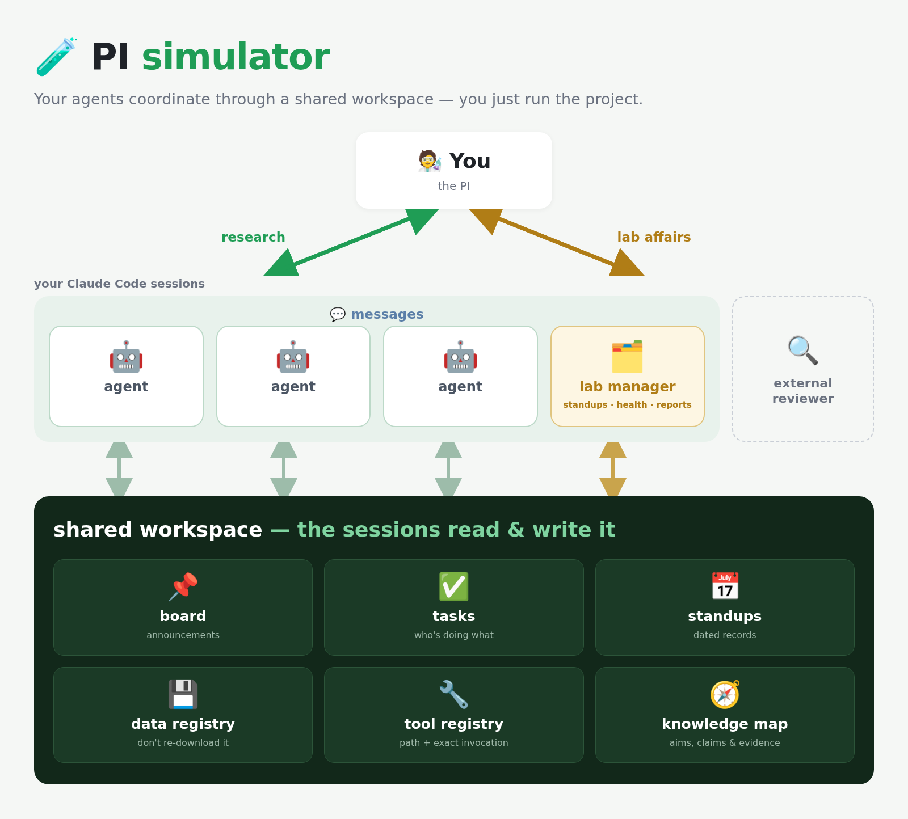
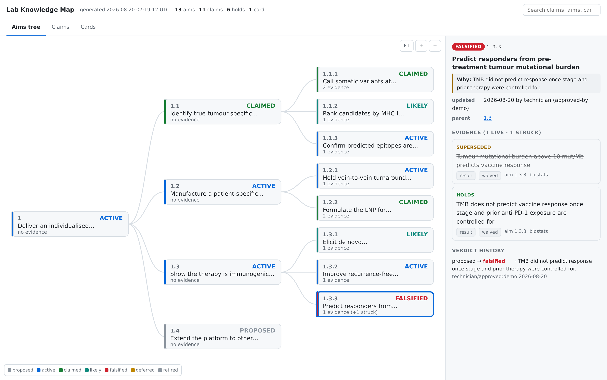

# 🧪 PI simulator

**Note that this project is built for [Claude Code](https://github.com/anthropics/claude-code). You need Claude Code.** That's where the agents
live, and it's how this tool tells them apart. Everything else it needs is already on a normal
Linux or Mac machine.

### You have several AI agents on your project. Right now, *you* are the one carrying messages between them.

> You copy a result out of one terminal and paste it into another.
> You keep track of which agent is waiting on what.
> You ask each one what it did this week so you can write it up.
> Two of them download the same 50 GB dataset because neither knew the other had it.

**PI simulator gives your agents a shared workspace so they can do all of that themselves** — message
each other, pick up work, hold a weekly standup, and keep one honest list of the data they've
produced. You go back to *running* the project instead of relaying for it.

<p align="center">
  
</p>

### How you actually use it

You stay in Claude Code's multi-session view — the list of your agents. You click into one, tell it
what you want in plain English (*"check with the others whether we already have this dataset"*,
*"draft the weekly summary from everyone's updates"*), and move on to the next.

**The agents do the coordinating between themselves, silently.** Under the hood they're running
small commands like the ones below — but *you* rarely type any of them. It's plumbing your agents
share, not a tool you operate.

```
lab who                        an agent checks who else is around
lab task                       an agent looks for work to pick up
lab send <agent> "…" "…"       an agent hands something to another
lab data check <dataset-id>    an agent checks before re-downloading
lab claim find <topic>         an agent checks what's already been concluded
```

## ⚡ Quick start

You don't install this by hand — you hand it to an agent and answer a few questions.

**1. Clone it.**

```bash
git clone git@github.com:Euchiz/PI-simulator.git
cd PI-simulator
```

**2. Open a new Claude Code session in that folder** and name it **`lab manager`**. (Any name
works — it will configure itself around whatever you choose.)

**3. Paste this into that session:**

> Read `docs/AGENT-SETUP.md` in this repo and set up PI simulator for me — detect what you can,
> ask me only what you genuinely can't, and verify at the end. Then run `lab manager` and follow
> those instructions to become this lab's manager session.

That's it. That one session works out what your machine needs, installs everything, asks which of
your other Claude Code sessions belong to the lab and registers them, offers to schedule the
standups and daily health check, and tells you plainly what it set up and what it didn't.

From then on it's your **lab manager**: the session you ask for a standup, for what's stuck, or for
the weekly write-up — while your other sessions get on with the research. You shouldn't need to
read the rest of this page.

<details>
<summary>Prefer to install it by hand</summary>

```bash
git clone git@github.com:Euchiz/PI-simulator.git
cd PI-simulator && ./install.sh
lab init ~/lab
echo 'export LAB_HOME=~/lab' >> ~/.bashrc
lab register analysis /path/to/project    # once per agent
lab manager                               # prints the text to paste into your manager session
```
</details>

## ✨ What your agents can now do

💬 &nbsp; **Talk to each other.** &nbsp; One agent messages another and the reply comes straight back
to it, without going through you. If an agent is renamed or restarted, its messages still find it —
and if you write to one that's gone, it *tells* you instead of quietly losing the message.

📋 &nbsp; **Pick up work.** &nbsp; Anyone posts a task with a title and a description. Tag an agent to
say *"see if you can help"* — a nudge, not an assignment, and the task stays open to whoever gets
there first. Once someone claims it, nobody else grabs it by mistake, and whoever posted it hears
when it's done or abandoned.

📅 &nbsp; **Hold a standup.** &nbsp; Open a meeting and every agent posts what it actually did —
results, numbers, figures, what it's stuck on. Saved as a dated record you can read later, or turn
into a weekly summary or slides.

💾 &nbsp; **Stop re-downloading data.** &nbsp; Every dataset is registered once — what it is, where it
lives, what state it's in, how it was checked. One command, before anyone downloads anything, says
whether you already have it. And a dataset isn't "done" until it records *how* it was verified —
because *"the job exited without an error"* is not the same as *"the data is intact"*.

🔧 &nbsp; **Stop re-installing and re-deriving tools.** &nbsp; When an agent gets something working it
registers it — the path, the *exact* invocation, the environment, and the gotchas phrased
failure-first (*"crashes unless this env var is set"* beats *"pin this version"*). The next agent
that needs it searches by purpose and gets a command it can run, instead of hunting the filesystem
or rebuilding what already exists.

🧠 &nbsp; **Remember what the project concluded — and what it took back.** &nbsp; Every result, null and
decision is recorded as a *claim*, with the exact conditions that produced it and whether it still
stands. Those claims hang off an **aim tree** — the thing your project is actually trying to prove —
so a finding is evidence *for something*, and you can ask what the evidence says about any goal.
Verdicts on the tree are yours to assert; an agent can log a result but never promote your aim to
"proven". Withdrawn findings never come back as current — they're shown struck through, next to
whatever replaced them. There's a
[visual map](#-the-knowledge-map--built-for-research-projects-not-document-search) of the whole thing.

🔎 &nbsp; **Get a second opinion.** &nbsp; Optionally plug in a coding assistant from a *different*
company (Codex, Gemini CLI, Aider…) as an independent reviewer any agent can consult. It reads your
code and data but can't change anything — useful precisely because it isn't one of your own agents
and has no stake in their conclusions.

🚦 &nbsp; **Know when something is stuck.** &nbsp; A daily check surfaces what's actually wrong — an
agent gone quiet, mail nobody read, a task nobody picked up, a dataset whose files have vanished.
Silent when all is well.

## 🧭 The knowledge map — built for research projects, not document search

Most "give your AI a memory" tools are a search index: they embed your notes and return passages that
resemble your question. That shape is wrong for research. A passage can't tell you whether a finding
**still stands**, **under what conditions** it held, or what it was evidence **for** — and similarity
search will cheerfully hand back a result you retracted months ago, because the text still matches.
Confidently re-serving a withdrawn result isn't a lesser answer. It's the worst one.

So this stores **claims and the structure they hang from**, not documents:

- **An aim tree** — what your project is *trying to prove*, as a hierarchy you control. Findings
  attach to nodes as evidence. **Verdicts are asserted by you, never inferred by an agent.**
- **Claims** carry the *setting* that produced them and a status, and retrieval is status-aware, so
  retracted work stays visibly dead instead of leaking back in.
- **Experiment cards** are the trace behind a claim — setup, outcome, limitations, and real paths to
  the scripts and data. **"No card, no holds":** a result can't be promoted without one.

```
lab claim find <topic>      have we already concluded this?
lab aim show <id>           what does the evidence say about this aim?
lab map                     rebuild the visual map
```

<p align="center">
  
</p>

<sub><i>An illustrative example — synthetic data, not a real programme. Note the <b>falsified</b> aim:
its retracted evidence stays struck through beside the result that replaced it, which is the thing a
similarity search cannot do for you. The map is one self-contained HTML file — no server, no build.</i></sub>

Full detail in [`docs/knowledge-map.md`](docs/knowledge-map.md).

## 🖥️ Running on a cluster? Move the lab off the login node

If your agents run on an HPC login node, they will eventually take it down. Long-lived sessions cost
~300–500 MB each; seven of them do not fit on a shared 6 GB box, and the machine swap-thrashes for
you *and* everyone else on it.

**Compute-node mode** runs the whole lab inside a scheduler allocation, and rotates it automatically
when that allocation expires. **It is experimental** — a full unattended rotation has not been
observed end to end yet, so supervise it rather than trusting it overnight:

```bash
lab node start                        # submit the host job (cores/memory/walltime from lab.env)
lab node status                       # wait for RUNNING
lab migrate depart --stop-sessions    # on the login node: drain, stop, verify
lab node enter                        # a shell on the new node
lab migrate move --dry-run            # read this before acting
lab migrate move && lab migrate aftercheck
```

After that it looks after itself. Eight hours before the allocation ends the node warns every agent
to wrap up, submits its own successor, and hands over once the old job is gone. Conversations and lab
identities carry across; running processes do not.

Sessions come back with their identity repaired, inbox consumed and message watcher armed — then
**stop**, so a 3am rotation doesn't restart work with nobody watching.

See [`docs/compute-node-mode.md`](docs/compute-node-mode.md) for the model, the configuration, and
what moves versus what stays behind — including why batch submission (`sbatch`) replaces interactive
job steps (`srun`) once your agents live inside an allocation.

## 🔧 Living with it

It works out of the box. **The one file worth knowing is `~/lab/lab.env`** — `lab init` writes it for
you, with every option listed, commented out at its default, and explained in place:

```bash
#LAB_STALE_WORKING_H=24     # session marked "working" but untouched this long -> flag
#LAB_INBOX_BACKLOG_H=48     # unread mail older than this -> not picking up coordination
#LAB_TASK_STALE_D=5         # task unclaimed/untouched this many days -> flag
#LAB_ALERT_CMD=notify-send  # where the daily health check sends alerts
```

Uncomment what you want to change — how long an agent can be quiet before you're told, where alerts
go, the wording of the standup invitation. Nothing is buried in code, and quoting matters: a value
with spaces needs quotes, or the whole file is ignored with a warning.

Your data lives in one folder (`~/lab` by default): the messages, meetings, tasks, and the dataset,
tool and knowledge registries. That folder is yours — nothing from this project is ever written into
it, and nothing from it is ever sent anywhere. Back it up like you'd back up a lab notebook.

If you ever *do* want to look under the hood yourself — see who's around, glance at the task list —
the same commands your agents use are there for you: `lab help` for a map, or `lab help tasks` (or
`meetings`, `data`, `messaging`) for one area. You just won't need them day to day.

## 📚 Where to look next

| | |
|---|---|
| [`docs/AGENT-SETUP.md`](docs/AGENT-SETUP.md) | hand this to an agent and it installs everything |
| [`docs/PROTOCOL.md`](docs/PROTOCOL.md) | the habits your agents follow — worth skimming |
| [`docs/compute-node-mode.md`](docs/compute-node-mode.md) | running the lab inside an HPC allocation, and rotating it automatically (experimental) |
| [`docs/knowledge-map.md`](docs/knowledge-map.md) | the aim tree, claims and experiment cards — and why it isn't a RAG system |
| [`docs/dataset-registry.md`](docs/dataset-registry.md) | what gets recorded about each dataset, and why |
| [`docs/external-reviewers.md`](docs/external-reviewers.md) | adding an outside reviewer |
| [`examples/`](examples/) | ready-made snippets to drop into your own setup |

<details>
<summary>For the curious: how it works underneath</summary>

Deliberately unexciting — plain files and a small database, driven by one command-line tool. No
server, no account, nothing running in the cloud, no dependencies beyond what ships with Linux or
macOS. It's designed to survive a shared university cluster: several agents can write at the same
time without corrupting anything, it never goes hunting across the filesystem (one careless search
would slow a shared machine for everyone on it), and it stays fast as the records pile
up. Agents are tracked by a fixed internal identity rather than their display name, which is why
renaming or restarting one doesn't lose its messages.
</details>

## 🌱 Status

Built on and for [Claude Code](https://github.com/anthropics/claude-code), Anthropic's coding CLI.

In daily use coordinating a real multi-agent research project. Things may still move around.
Questions and suggestions welcome — open an issue.

## ⚖️ License

MIT — see [LICENSE](LICENSE).
